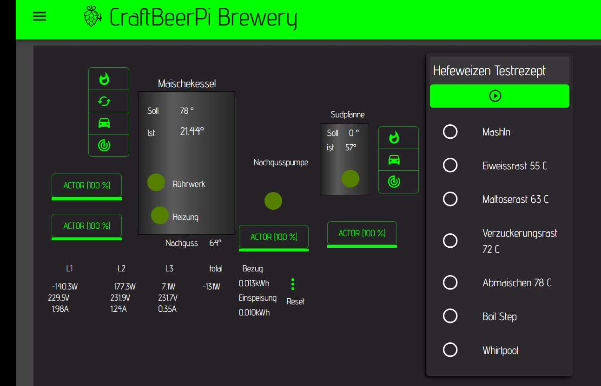
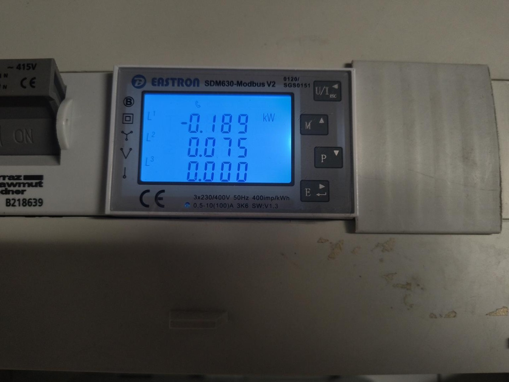
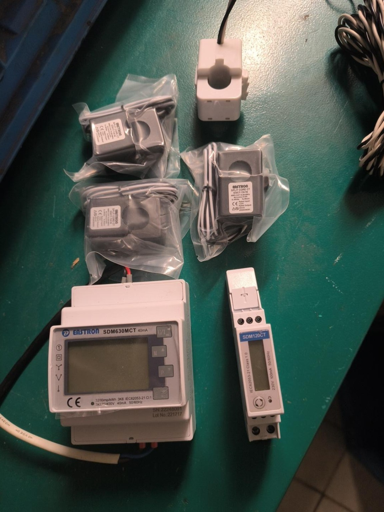
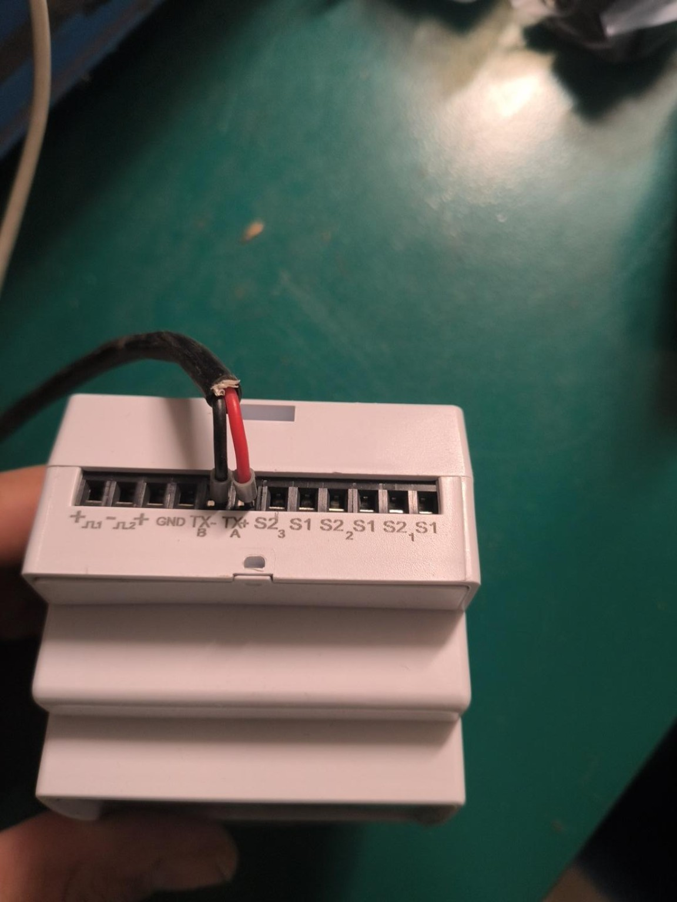
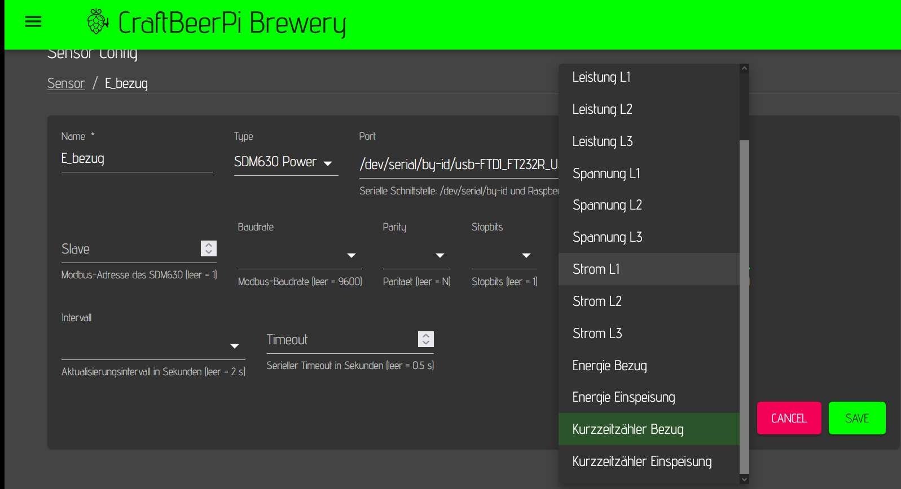

# cbpi4-sdm630

CraftBeerPi 4 plugin for an Eastron SDM630 connected via Modbus RTU and a USB/RS485 adapter.



## 🆕 New in v0.1.5

> **Resettable import/export trip counters, expanded three-phase measurements and convenient serial-port selection.**

The plugin can now be used as a compact electrical-energy dashboard inside CraftBeerPi:

- ⚡ active power for L1, L2, L3 and total system power
- 🔌 phase-to-neutral voltage for L1, L2 and L3
- 📈 current for L1, L2 and L3
- 🔋 cumulative imported and exported energy from the SDM630
- 🆕 **resettable short-term import and export energy counters** (`Kurzzeitzähler`)
- 🔄 one CraftBeerPi action resets both short-term counters together
- 💾 reset values survive CraftBeerPi and Raspberry Pi restarts
- 🔎 available serial interfaces are offered in the hardware configuration; stable `/dev/serial/by-id/...` paths are preferred

The short-term counters work like a vehicle trip counter. Resetting them does **not** modify or reset the SDM630's own cumulative energy registers.

## Why a wired Modbus meter?

A useful advantage of the SDM630 Modbus family is the **direct wired connection to the Raspberry Pi**. With a USB/RS485 adapter, the meter communicates locally with CraftBeerPi over Modbus RTU.

Compared with network-based energy meters such as a Shelly 3EM, this setup does **not require Wi-Fi or Ethernet for the meter connection**. Once the Raspberry Pi and SDM630 are connected by RS485, measurement acquisition can continue independently of the local Wi-Fi network, access point or router.

This can be particularly useful in brewing-control installations because:

- the meter-to-controller link is a dedicated wired RS485 connection,
- no Wi-Fi coverage is required at the electrical cabinet,
- measurement acquisition does not depend on a network connection between the meter and Raspberry Pi,
- RS485 is designed for robust serial communication and can be used over comparatively long cable runs,
- several Modbus devices can in principle share one RS485 bus when correctly addressed and wired.

The Raspberry Pi itself may of course still use Ethernet or Wi-Fi for the CraftBeerPi web interface and other network services; only the **SDM630 measurement connection** is independent of them.

## Meter variants

The Eastron SDM family contains different hardware variants. The important distinction is how the current is measured.

### SDM630 direct measurement

The directly connected SDM630-Modbus measures the phase currents without external current transformers (CTs). The load conductors are routed through the meter's current terminals. This is convenient for installations within the meter's specified direct-current range.



### SDM630MCT with external current transformers

The SDM630MCT is intended for external CTs. This is useful when the load current cannot or should not be routed directly through the meter. The photo below shows an SDM630MCT together with split-core CTs. An SDM120CT single-phase meter is shown on the right for comparison.



On the pictured SDM630MCT, the communication terminals are marked directly on the housing. The RS485 pair is labelled `TX- / B` and `TX+ / A`.



> **Compatibility note:** This project currently targets the **three-phase SDM630 Modbus family**. Single-phase Eastron meters such as the SDM120/SDM120CT family are **not currently supported** by this plugin. Their Modbus register maps and available measurements can differ, so they should not simply be configured as an SDM630 sensor.

Always verify the terminal markings and manual for the exact meter variant before wiring it.

## Official Eastron Modbus documentation

Official manufacturer documentation:

**Eastron SDM630Modbus Smart Meter – Modbus Protocol Implementation V1.8**

https://www.eastroneurope.com/images/uploads/products/protocol/SDM630_MODBUS_Protocol.pdf

A repository-local description of the exact registers used by this plugin is available here:

[SDM630 Modbus reference – registers used by this plugin](docs/SDM630_MODBUS_REFERENCE.md)

## Measurements

The plugin provides a CraftBeerPi sensor type named `SDM630 Power`. Multiple sensor instances can be created, each selecting one SDM630 measurement.

Direct SDM630 values:

- Gesamtleistung: register 30053 / PDU address 52, W
- Leistung L1: register 30013 / PDU address 12, W
- Leistung L2: register 30015 / PDU address 14, W
- Leistung L3: register 30017 / PDU address 16, W
- Spannung L1: register 30001 / PDU address 0, V L-N
- Spannung L2: register 30003 / PDU address 2, V L-N
- Spannung L3: register 30005 / PDU address 4, V L-N
- Strom L1: register 30007 / PDU address 6, A
- Strom L2: register 30009 / PDU address 8, A
- Strom L3: register 30011 / PDU address 10, A
- Energie Bezug: register 30073 / PDU address 72, kWh
- Energie Einspeisung: register 30075 / PDU address 74, kWh

Derived values calculated by the plugin:

- **🆕 Kurzzeitzähler Bezug:** imported energy since the last manual reset, kWh
- **🆕 Kurzzeitzähler Einspeisung:** exported energy since the last manual reset, kWh

## Resetting the short-term counters

The sensor type provides the CraftBeerPi action:

`Kurzzeitzähler nullen`

This action resets **both** short-term counters together:

- Kurzzeitzähler Bezug → 0.000 kWh
- Kurzzeitzähler Einspeisung → 0.000 kWh

The underlying SDM630 total energy counters remain unchanged.

The reset baseline is stored persistently in:

```text
~/.craftbeerpi4-sdm630/short_term_counters.json
```

Therefore the short-term counters survive CraftBeerPi restarts and Raspberry Pi reboots. The state is kept separately for every combination of serial port and Modbus slave address.

In the CraftBeerPi dashboard, enable the action for the SensorData widget. The three-dot action menu then provides `Kurzzeitzähler nullen`.

## Data format

The direct SDM630 registers are read as:

- Modbus Function Code 04 – Read Input Registers
- IEEE-754 Float32
- two 16-bit Modbus registers per value
- big-endian register order

Display rounding:

- power: 1 decimal place
- voltage: 1 decimal place
- current: 2 decimal places
- energy: 3 decimal places

## CraftBeerPi hardware configuration

Create a hardware sensor and select type `SDM630 Power`. The plugin exposes the available measurements directly in the `Messwert` selection:



For every value you want to display, create one sensor instance. Typical examples are:

1. `SDM630 L1 Leistung` → `Leistung L1`
2. `SDM630 L2 Leistung` → `Leistung L2`
3. `SDM630 L3 Leistung` → `Leistung L3`
4. `SDM630 Gesamtleistung` → `Gesamtleistung`
5. `SDM630 Spannung L1/L2/L3` → corresponding voltage measurement
6. `SDM630 Strom L1/L2/L3` → corresponding current measurement
7. `SDM630 Bezug gesamt` → `Energie Bezug`
8. `SDM630 Einspeisung gesamt` → `Energie Einspeisung`
9. **🆕 `SDM630 Kurzzeit Bezug` → `Kurzzeitzähler Bezug`**
10. **🆕 `SDM630 Kurzzeit Einspeisung` → `Kurzzeitzähler Einspeisung`**

Use identical Port, Slave, Baudrate, Parity and Stopbits settings for all sensor instances belonging to the same physical SDM630.

The plugin uses a shared asynchronous lock and a short-lived cache, so multiple CraftBeerPi sensor instances do not try to access the same USB/RS485 adapter simultaneously.

## CraftBeerPi default handling

CraftBeerPi 4.7.x does not visibly prefill all plugin properties when a new sensor is created. Empty properties are accepted and sensible defaults are applied internally:

- Port: first detected serial interface, with `/dev/serial/by-id/...` preferred
- Slave: `1`
- Baudrate: `9600`
- Parity: `N`
- Stopbits: `1`
- Messwert: `Gesamtleistung`
- Intervall: `2 s`
- Timeout: `0.5 s`

If more than one USB/serial adapter is connected, explicitly select the correct `/dev/serial/by-id/...` entry.

## Tested hardware settings

This repository was initially tested with:

- SDM630 Modbus address: 1
- Baudrate: 9600
- Data format: 8N1
- USB/RS485 adapter: FTDI FT232R / FTDI USB-RS485-WE
- Stable Linux device path: `/dev/serial/by-id/usb-FTDI_FT232R_USB_UART_A99RF4P0-if00-port0`

The serial settings and device path remain configurable in CraftBeerPi.

## Installation

On a CraftBeerPi 4 installation managed with pipx, install directly from GitHub:

```bash
pipx runpip cbpi4 install https://github.com/alexseuf/cbpi4-sdm630/archive/main.zip
sudo systemctl restart craftbeerpi.service
```

## Updating the plugin

```bash
pipx runpip cbpi4 install --upgrade https://github.com/alexseuf/cbpi4-sdm630/archive/main.zip
sudo systemctl restart craftbeerpi.service
```

Check the installed package version with:

```bash
pipx runpip cbpi4 show cbpi4-sdm630
```

If pip reports that the same version is already installed but the repository contains newer code:

```bash
pipx runpip cbpi4 install --upgrade --force-reinstall https://github.com/alexseuf/cbpi4-sdm630/archive/main.zip
sudo systemctl restart craftbeerpi.service
```

## Installation and RS485 test

A complete step-by-step description of the tested Raspberry Pi setup, CraftBeerPi service commands, FTDI wiring and standalone RS485/Modbus test is available here:

[Installation and RS485 test](docs/INSTALLATION_AND_RS485_TEST.md)

Typical communication settings:

- Port: `/dev/serial/by-id/usb-FTDI_FT232R_USB_UART_A99RF4P0-if00-port0`
- Slave: `1`
- Baudrate: `9600`
- Parity: `N`
- Stopbits: `1`
- Interval: `2 s`
- Timeout: `0.5 s`

If communication fails, verify RS485 A/B polarity, Modbus address, baudrate, parity, stopbits and serial-device permissions.
